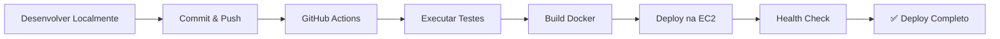

# 🤖 Deploy Automático para AWS

Este repositório está configurado para **deploy automático** na AWS EC2 usando GitHub Actions.

## 🚀 Como Funciona

Quando você faz **push** para as branches principais, o GitHub Actions automaticamente:

1. ✅ Executa testes
2. 🏗️ Faz build da aplicação
3. 📦 Conecta na EC2
4. 🔄 Atualiza o código
5. 🚀 Reinicia os containers
6. ✅ Verifica se está funcionando

## 📋 Configuração Inicial (Uma vez só)

### 1. Configurar Secrets no GitHub

Vá para **Settings** → **Secrets and variables** → **Actions** → **New repository secret**

Adicione os seguintes secrets:

| Nome | Valor | Descrição |
|------|-------|-----------|
| `EC2_HOST` | `52.12.34.56` | IP público da sua EC2 |
| `EC2_SSH_KEY` | `conteúdo do .pem` | Chave privada SSH (todo o conteúdo do arquivo .pem) |
| `ODDS_API_KEY` | `sua_chave` | API key para The Odds API (opcional) |

**Como copiar a chave SSH:**

```bash
# No Windows (Git Bash):
cat ~/Downloads/prognosticos-aws.pem | clip

# No Linux/Mac:
cat ~/Downloads/prognosticos-aws.pem | pbcopy
```

Cole o conteúdo completo no secret `EC2_SSH_KEY`.

### 2. Preparar EC2 (Uma vez só)

Na sua EC2, execute:

```bash
# Criar diretório para a aplicação
sudo mkdir -p /home/ubuntu/prognosticos-brasileirao
sudo chown ubuntu:ubuntu /home/ubuntu/prognosticos-brasileirao

# Clonar repositório
cd /home/ubuntu
git clone https://github.com/wemarques/prognosticos-brasileirao.git
cd prognosticos-brasileirao

# Escolher branch
git checkout claude/frontend-review-improvements-01SLDqfrpQJaeBCaHmyLkkcU

# Criar .env
nano .env
# Adicionar: ODDS_API_KEY=sua_chave

# Fazer primeiro deploy manual
docker-compose up -d
```

## ✨ Usando Deploy Automático

### Opção 1: Push Automático (Recomendado)

Simplesmente faça push para as branches configuradas:

```bash
# No seu computador
git add .
git commit -m "feat: Nova funcionalidade"
git push origin claude/frontend-review-improvements-01SLDqfrpQJaeBCaHmyLkkcU
```

🎉 **Pronto!** O GitHub Actions vai automaticamente fazer o deploy na AWS!

### Opção 2: Deploy Manual via GitHub

1. Vá para **Actions** → **Deploy to AWS EC2**
2. Clique em **Run workflow**
3. Selecione a branch
4. Clique em **Run workflow**

### Opção 3: Deploy Manual via Script

Se o GitHub Actions não estiver disponível:

```bash
# No seu computador (Git Bash):
export EC2_HOST="52.12.34.56"
export EC2_KEY_PATH="~/Downloads/prognosticos-aws.pem"
./scripts/deploy-aws.sh
```

## 📊 Acompanhar Deploy

### Ver status em tempo real

1. Vá para **Actions** no GitHub
2. Clique no workflow em execução
3. Acompanhe cada etapa

### Ver logs da aplicação

```bash
# SSH na EC2
ssh -i ~/Downloads/prognosticos-aws.pem ubuntu@SEU-IP-EC2

# Ver logs
cd prognosticos-brasileirao
docker-compose logs -f app
```

## 🔄 Fluxo de Trabalho Completo



## 🛠️ Comandos Úteis

### Verificar status do deploy

```bash
# Ver último deploy
gh run list --workflow=deploy-aws.yml --limit=1

# Ver detalhes
gh run view
```

### Fazer rollback

```bash
# SSH na EC2
cd /home/ubuntu/prognosticos-brasileirao

# Voltar para commit anterior
git log --oneline -5  # Ver últimos commits
git checkout <commit-hash>
docker-compose down
docker-compose up -d
```

### Atualizar apenas CSVs

```bash
# No seu computador
git add data/csv/
git commit -m "chore: Update CSV data"
git push

# Deploy automático vai atualizar os CSVs
```

## 🐛 Troubleshooting

### Deploy falhou

1. Vá para **Actions** → Clique no workflow com ❌
2. Veja qual step falhou
3. Clique no step para ver logs detalhados

### SSH não conecta

Verifique:
- ✅ Secret `EC2_HOST` está correto (IP público)
- ✅ Secret `EC2_SSH_KEY` tem a chave completa
- ✅ Security Group da EC2 permite SSH (porta 22) do GitHub Actions
  - IP ranges do GitHub: `185.199.108.0/22`, `140.82.112.0/20`, `143.55.64.0/20`

### Health check falha

```bash
# SSH na EC2
docker-compose logs app

# Verificar se porta 8501 está aberta
sudo netstat -tlnp | grep 8501

# Reiniciar
docker-compose restart app
```

## 🔐 Segurança

- ✅ Chave SSH nunca é commitada
- ✅ Secrets são criptografados pelo GitHub
- ✅ Deploy só acontece em branches autorizadas
- ✅ Health check garante que aplicação está funcionando

## 📈 Branches Configuradas

Deploy automático acontece em:
- `main`
- `claude/fix-system-errors-01AK1ZbdXd1Pvipn2yyzNNcN`
- `claude/frontend-review-improvements-01SLDqfrpQJaeBCaHmyLkkcU`

Para adicionar mais branches, edite `.github/workflows/deploy-aws.yml`.

## 💡 Próximos Passos

- [ ] Configurar notificações (Slack, Discord, Email)
- [ ] Adicionar testes automatizados
- [ ] Configurar múltiplos ambientes (staging, production)
- [ ] Implementar blue-green deployment
- [ ] Adicionar rollback automático se health check falhar

## 📞 Suporte

- **Logs do GitHub Actions**: Settings → Actions → Logs
- **Logs da aplicação**: SSH na EC2 → `docker-compose logs app`
- **Documentação**: `DEPLOY_AWS_CSV.md`, `DEPLOY_INICIO_RAPIDO.md`

---

**Criado:** 2025-11-16
**Status:** ✅ Deploy Automático Configurado
**Última atualização:** {{date}}
